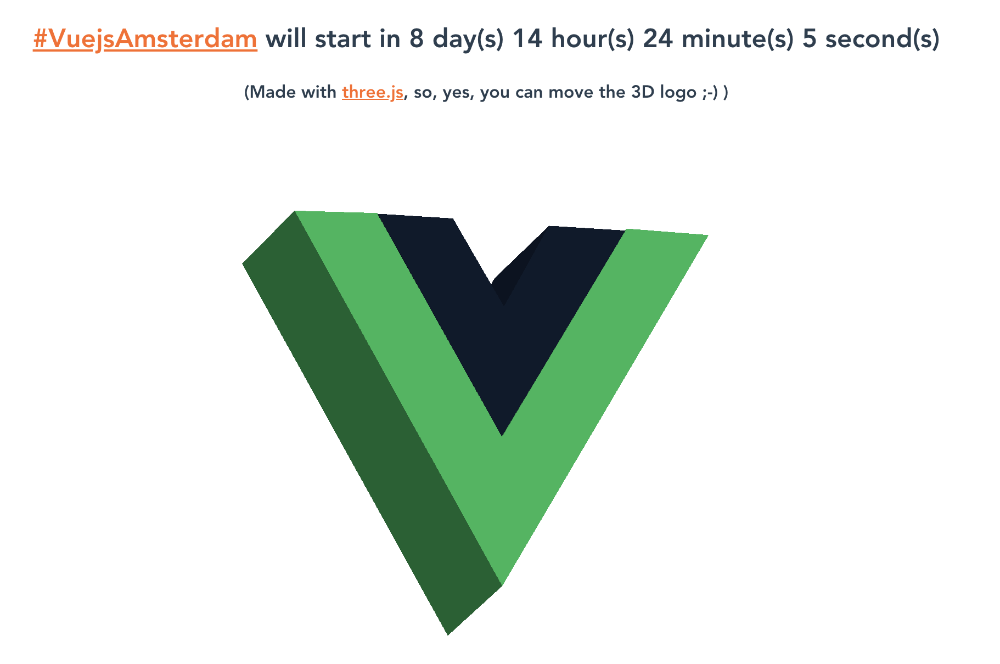

# vuejs-logo-3d

## Project setup
```
npm install
```

### Compiles and hot-reloads for development
```
npm run serve
```

### Compiles and minifies for production
```
npm run build
```

> Problem with Terser. Workaround:
```bash
npm i terser@3.14
```


